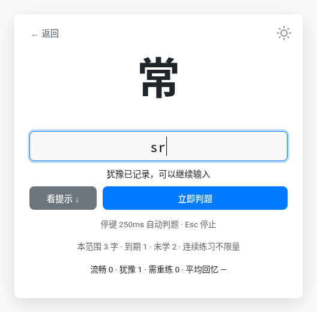

# 码上生花

练单字的编码和码长。支持虎整句、飞单和自定义码表，记录打错、打过与犹豫，安排间隔复习。

## 使用

浏览器直接打开 [index.html](index.html)，无需安装或构建。虎整句码表已内置，可离线练习；飞单码表从网络加载。点击码表旁的「＋」可导入 Rime YAML 或字码 TXT。

选择范围，开始练习。默认混合码长、连续练习，停键后自动判题和换字，累了就停。也可只练某一码长，或粘贴自己想练的字。

- **Esc**：停止。
- **↓ / F1**：看提示。
- **空格 / Enter**：立即判题或跳过反馈；手动模式下用于提交、换字。

练习设置截图

## 复习

错字隔 1 个字、犹豫字隔 2 个字后优先重练。流畅通过后，依次在 1 分钟、10 分钟后复习，再逐步拉长间隔。到期字优先出现，码长不按固定顺序排列。

正确的短前缀处停顿超过 1.2 秒，会立即记录犹豫，可以继续输入。退出也保留，补完不重复计数。切到后台的时间不算。

后续间隔使用 [FSRS-6](https://github.com/open-spaced-repetition/awesome-fsrs/wiki/The-Algorithm) 的默认参数，尚未加入个人参数训练。「到期复习」模式有每日新字额度；默认的连续练习不限题数。

## 进度

进度保存在当前浏览器，各码表分开记录，兼容旧飞单进度。支持 JSON 导入、导出；换浏览器或访问地址前先导出备份。

码表规则与调度细节见 [实现说明](docs/implementation.md)。
